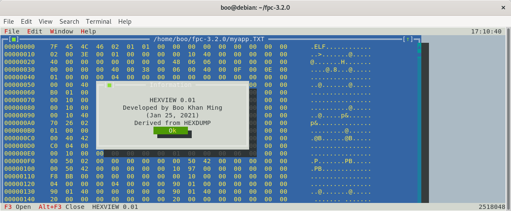
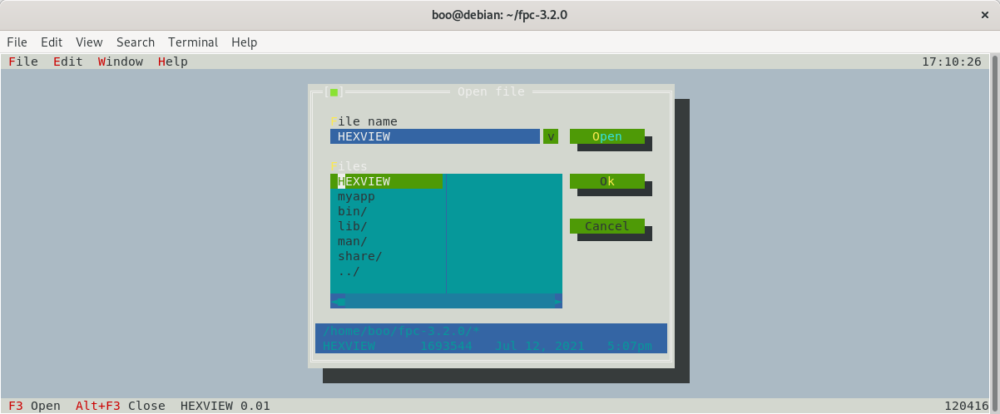
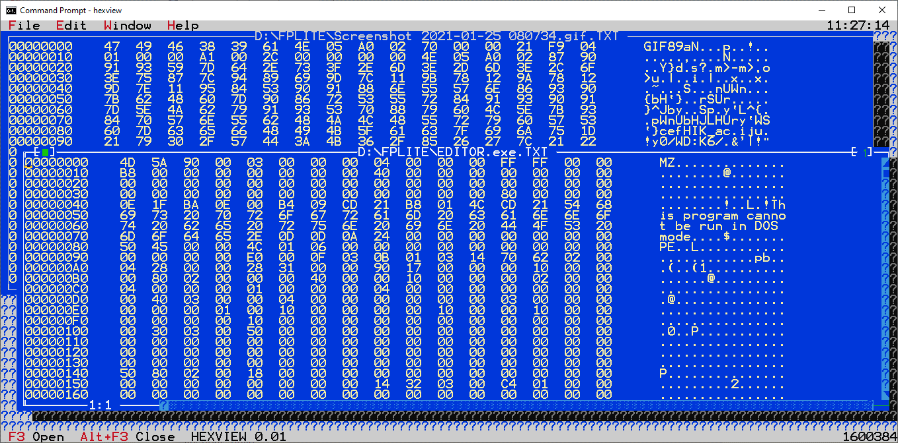
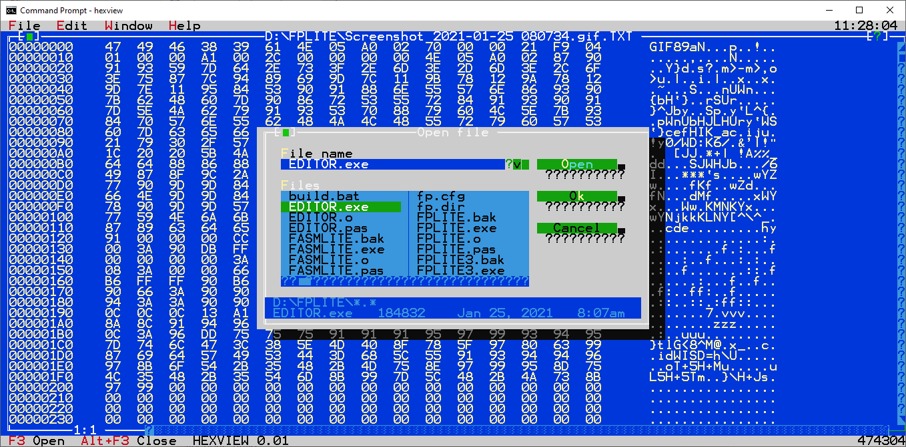

# HEXVIEW
#### Cross-Platform Hexadecimal Viewer

This is a binary file viewer which let you open multiple window and save each of these window as text file.

It is available in Linux x64 and Windows x86, but you can always use Free Pascal to compile to different target OS and CPU architecture.

## Linux x64
#### HEXVIEW (without file extension)

## Windows x86
#### HEXVIEW.exe

## Pascal Source
#### HEXVIEW.pas

Please download FPC 3.2.x for the target OS, and compile HEXVIEW.pas.

